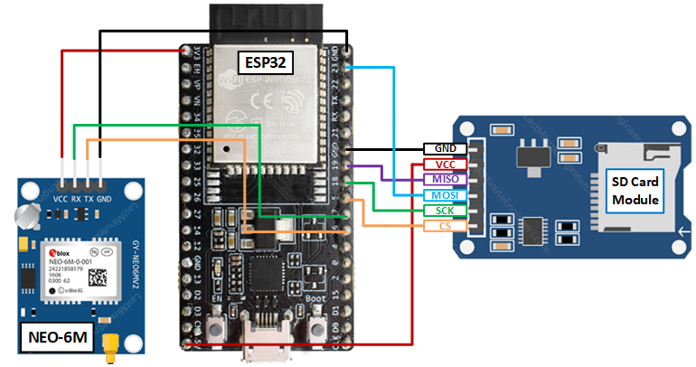

# Tiny GPS Logger

Portable GPS logging device built with ESP32, NEO-6M, and Catalex Micro SD Card Module.

## Hardware Schematic & Pin Connection
 

| ESP32  | SD Card Module |
| ------ | -------------- |
| Pin 5  | CS             |
| Pin 18 | SCK            |
| Pin 23 | MOSI           |
| Pin 19 | MISO           |
| 5V     | VCC            |
| GND    | GND            |

| ESP32  | NEO-6M |
| ------ | ------ |
| 3V3    | VCC    |
| Pin 17 | RX     |
| Pin 16 | TX     |
| GND    | GND    |

## BLE Instruction Codes

| Hex Code | Function           | Description                                               |
| :------: | ------------------ | --------------------------------------------------------- |
|   0x00   | None               | Code Not Assigned                                         |
|   0x01   | Get device status  | Get current GPS device statue code (see GPS Status Flags) |
|   0x02   | Toggle GPS on      | Turn GPS location service on                              |
|   0x03   | Toggle GPS off     | Turn GPS location service off                             |
|   0x04   | Toggle logging on  | Turn GPS sentences logging on                             |
|   0x05   | Toggle logging off | Turn GPS sentences logging off                            |
|   0x06   | Get GPS data       | Get current GPS location data if GPS has fix              |
|   0x07   | List Files         | List all current log files on GPS SD card                 |
|   0x08   | Read File          | Read log file from GPS SD card                            |
|   0x09   | Get SD Card Status | Get SD card usage information                             |
|   0x0a   | Reboot             | Reboot GPS device                                         |
|   0x0b   | Reset              | Reset GPS device configurations and all status flags      |

## GPS Status Flags

#### 4 Bit GPS Status Flag System

| Bit Index | Function          | Description                                    |
| :-------: | ----------------- | ---------------------------------------------- |
|     0     | BLE Connection    | True if BLE service is connected to BLE client |
|     1     | GPS On/Off Status | True if GPS service is enabled on device       |
|     2     | GPS Has Fix       | True if GPS has location fix                   |
|     3     | Logging Status    | True if GPS sentences logging is enabled       |

## Resource & Reference Links

#### GPS Module
- [NMEA Sentences](https://www.gpsinformation.org/dale/nmea.htm)
- [Tiny GPS++ Library](http://arduiniana.org/libraries/tinygpsplus/)
- [Guide to NEO-6M GPS Module](https://randomnerdtutorials.com/guide-to-neo-6m-gps-module-with-arduino/)
- [Interface ublox NEO-6M GPS Module](https://lastminuteengineers.com/neo6m-gps-arduino-tutorial/)
- [NEO-6M DataSheet](https://www.u-blox.com/sites/default/files/products/documents/NEO-6_DataSheet_%28GPS.G6-HW-09005%29.pdf)
- [NEO-6M Product Summary](https://www.u-blox.com/sites/default/files/products/documents/NEO-6_ProductSummary_%28GPS.G6-HW-09003%29.pdf)
- [NEOGPS Repo](https://github.com/SlashDevin/NeoGPS/tree/master/examples)
- [LoRaTracker GPS Tutorial](https://github.com/LoRaTracker/GPSTutorial)

#### ESP32
- [ESP32 DataSheet](https://www.espressif.com/sites/default/files/documentation/esp32_datasheet_en.pdf)
- [ESP32 Wiki](http://arduinoinfo.mywikis.net/wiki/Esp32)

#### SD Card Module
- [ESP32 Logging to MicroSD Card](https://randomnerdtutorials.com/esp32-data-logging-temperature-to-microsd-card/)
- [Interfacing Micro SD Card Module](https://lastminuteengineers.com/arduino-micro-sd-card-module-tutorial/)
- [Arduino SD Library](https://www.arduino.cc/en/reference/SD)

#### Bluetooth Low Energy
- [ESP32 BLE Guide](https://randomnerdtutorials.com/esp32-bluetooth-low-energy-ble-arduino-ide/)
- [Characteristic with Multiple Descriptors](https://github.com/espressif/arduino-esp32/issues/1038)
- [Indication & Notification](https://community.nxp.com/docs/DOC-328525)
- [BLE introduction: Notify or Indicate ](https://www.onethesis.com/2015/11/21/ble-introduction-notify-or-indicate/)

#### Dev Tools
- [UUID Generator](https://www.uuidgenerator.net/)
- [ASCII TO HEX](https://www.asciitohex.com/)
- [BLE Test Tool](https://github.com/emericg/toolBLEx)
