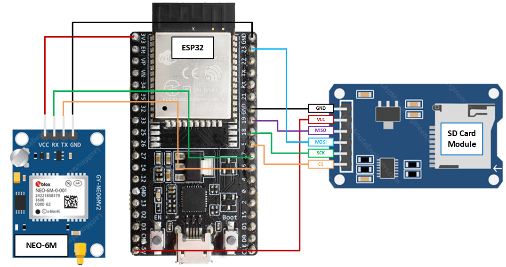

# Tiny GPS Logger

Portable GPS logging device built with ESP32, NEO-6M, and Catalex Micro SD Card Module.

## Hardware Schematic & Pin Connection

| ESP32 | NEO-6M |
| --- | --- |
| 3V3    | VCC  |
| Pin 17 | RX	  |
| Pin 16 | TX   |
| GND    | GND	|

| ESP32 | SD Card Module |
| --- | --- |
| Pin 5  | CS   |
| Pin 18 | SCK	|
| Pin 23 | MOSI |
| Pin 19 | MISO	|
| 5V 		 | VCC  |
| GND    | GND  |

## Android App Guide

## BLE Instruction Code

| Hex Code | Function | Description |
| :---: | --- | --- |
| 0x00 | None             			| Code Not Assigned |
| 0x01 | Get device status 			| Get current GPS device statue code (see GPS Status Flags) |
| 0x02 | Toggle GPS on 					| Turn GPS location service on 	|
| 0x03 | Toggle GPS off 				| Turn GPS location service off |
| 0x04 | Toggle logging on 			| Turn GPS sentences logging on |
| 0x05 | Toggle logging off 		| Turn GPS sentences logging off |
| 0x06 | Toggle BLE print on 		| Start sending GPS sentences via BLE and serial |
| 0x07 | Toggle BLE print off 	| Stop sending GPS sentences via BLE and serial  |
| 0x08 | Get GPS data 					| Get current GPS location data if GPS has fix   |
| 0x09 | List Files 						| List all current log files on GPS SD card |
| 0x0a | Read File 							| Read log file from GPS SD card |
| 0x0b | Get SD Card Status 		| Get SD card usage information |
| 0x0c | Reboot 								| Reboot GPS device |
| 0x0d | Reset 									| Reset GPS device configurations and all status flags |

## GPS Status Flags

### 6 Bit GPS Status Flag System

| Bit Index | Function | Description |
| :---: | --- | --- |
| 0 | BLE Connection 		| True if BLE service on GPS device is connected to BLE client |
| 1 | GPS Has Fix 							| True if GPS has location fix |
| 2 | GPS On/Off Status					| True if GPS service is enabled on device |
| 3 | Serial Print Status  	| True if GPS sentences serial print is enabled |
| 4 | BLE Print Status  		| True if GPS sentences BLE print is enabled |
| 5 | Logging Status 						| True if GPS sentences logging is enabled |

## Resource Links

GPS Module
- [NMEA Messages Info](https://www.gpsinformation.org/dale/nmea.htm)
- [Tiny GPS++ Library](http://arduiniana.org/libraries/tinygpsplus/)
- [NEO-6M Guide A](https://randomnerdtutorials.com/guide-to-neo-6m-gps-module-with-arduino/)
- [NEO-6M Guide B](https://lastminuteengineers.com/neo6m-gps-arduino-tutorial/)
- [NEO-6M DataSheet](https://www.u-blox.com/sites/default/files/products/documents/NEO-6_DataSheet_%28GPS.G6-HW-09005%29.pdf)
- [NEO-6M Product Summary](https://www.u-blox.com/sites/default/files/products/documents/NEO-6_ProductSummary_%28GPS.G6-HW-09003%29.pdf)
- [NEOGPS](https://github.com/SlashDevin/NeoGPS/tree/master/examples)

SD CARD Module
- [ESP32 SD Card Example](https://randomnerdtutorials.com/esp32-data-logging-temperature-to-microsd-card/)
- [SD Card Example](https://lastminuteengineers.com/arduino-micro-sd-card-module-tutorial/)
- [SD Library](https://www.arduino.cc/en/reference/SD)

Bluetooth Low Energy
- [UUID Generator](https://www.uuidgenerator.net/)
- [ESP32 BLE Guide](https://randomnerdtutorials.com/esp32-bluetooth-low-energy-ble-arduino-ide/)
- [Change Characteristic](https://github.com/espressif/arduino-esp32/issues/1038)
- Indication & Notification [Link1](https://community.nxp.com/docs/DOC-328525) [Link2](https://www.onethesis.com/2015/11/21/ble-introduction-notify-or-indicate/)

Android App
- [Bluetooth Device](https://developer.android.com/reference/kotlin/android/bluetooth/package-summary)
- [Bluetooth GATT](https://developer.android.com/reference/android/bluetooth/BluetoothGatt)
- [BLE Basics](https://developer.android.com/guide/topics/connectivity/bluetooth-le)
- [GATT Services & Characteristics](https://www.oreilly.com/library/view/getting-started-with/9781491900550/ch04.html)
- [Remote adb](https://stackoverflow.com/questions/4893953/run-install-debug-android-applications-over-wi-fi)
- [Kotlin Map](https://pusher.com/tutorials/realtime-map-kotlin)
- [Kotlin Real Time Map repo](https://github.com/neoighodaro/realtime-map-example-kotlin/blob/master/app/src/main/java/com/example/android/realtimemapkotlin/MainActivity.kt)
- [Map object Doc](https://developers.google.com/maps/documentation/android-sdk/map)
- [Map View Doc](https://developers.google.com/android/reference/com/google/android/gms/maps/MapView)
- [offline maps](https://docs.mapbox.com/android/maps/overview/)

## Remote adb debug

1. Connect the device via USB and make sure debugging is working;
2. `adb tcpip 5555` This makes the device to start listening for connections on port 5555;
3. Look up the device IP address with `adb shell netcfg` or `adb shell ifconfig` with 6.0 and higher;
4. Disconnect the USB now;
5. `adb connect <DEVICE_IP_ADDRESS>:5555`. This connects to the server we set up on the device on step 2;
6. Now you have a device over the network with which you can debug as usual.

- To switch the server back to the USB mode, run `adb usb`, which will put the server on your phone back to the USB mode.
- If you have more than one device, you can specify the device with the -s option: `adb -s <DEVICE_IP_ADDRESS>:5555 usb`
- To find the IP address of the device: run `adb shell` and then `netcfg`.
- To find the IP address while using OSX run the command adb shell ip route.
